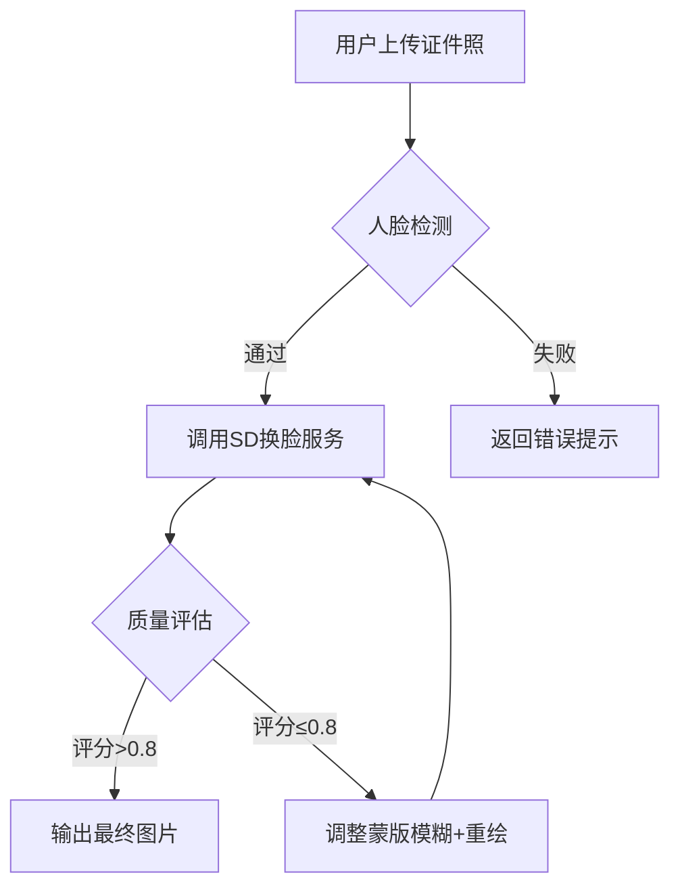

### 基于 Dify + Stable Diffusion 的换脸工作流搭建方案

---

#### **一、技术架构设计**
1. **核心组件集成**  
   • **Stable Diffusion 模型**：作为换脸算法执行引擎，需提前部署在本地或云服务器（支持 API 调用）  
   • **Dify Workflow**：通过可视化编排工具实现流程自动化，包含输入处理、模型调用、结果优化等节点  
   • **附加工具**：可集成 Roop 插件（简化换脸操作）或自定义 Python 脚本（处理图像预处理）

---

#### **二、Dify 工作流搭建步骤**
> **注**：以下流程基于网页的 Dify 工作流设计方法，适配 Stable Diffusion 技术需求

1. **前期准备**  
   • 在 Dify 平台创建新工作流项目，选择 **Workflow** 类型  
   • 部署 Stable Diffusion 服务：  
     ```python
     # 示例：通过 API 调用 SD 服务（需提前部署）
     import requests
     def sd_face_swap(source_img, target_img):
         response = requests.post("http://sd-api/swap", 
                               files={'source': source_img, 'target': target_img})
         return response.content
     ```

2. **工作流节点配置**  
   | 节点类型         | 功能说明                                               | 参数设置示例                         |
   | ---------------- | ------------------------------------------------------ | ------------------------------------ |
   | **开始节点**     | 接收用户上传的源人脸图片与目标图片                     | 输入参数：`source_img`, `target_img` |
   | **代码执行节点** | 调用 Stable Diffusion 换脸 API                         | 嵌入上述 Python 函数                 |
   | **HTTP请求节点** | 可选，若 SD 服务为 RESTful API                         | 配置请求头与 Body 格式               |
   | **条件分支节点** | 判断换脸结果质量（如通过 CLIP 模型评分）               | 阈值设定：`quality_score > 0.8`      |
   | **循环节点**     | 对低质量结果自动调整参数重试（如重绘幅度、蒙版模糊度） | 最大迭代次数：3                      |
   | **结束节点**     | 输出最终换脸结果及质量报告                             | 输出变量：`result_img`, `report`     |

3. **关键参数优化**（来自网页）  
   • **蒙版模糊**：设置 20-40 使换脸边缘过渡自然  
   • **重绘幅度**：建议 0.5-0.7 平衡细节保留与生成效果  
   • **分辨率控制**：启用“仅蒙版”模式（512x512）避免显存溢出  

---

#### **三、进阶功能实现**
1. **批量换脸处理**  
   • 在工作流中添加 **迭代节点**，遍历图片数据集自动执行换脸  
   • 示例代码结构：  
     ```python
     for batch in image_batches:
         result = sd_face_swap(batch['source'], batch['target'])
         save_to_cloud_storage(result)
     ```

2. **Roop 插件集成**（参考网页）  
   • 在代码节点中调用 Roop 的 `inswapper_128` 模型：  
     ```python
     from roop import core
     def roop_swap(source, target):
         return core.swap_face(source, target, model_path="inswapper_128.onnx")
     ```

3. **质量验证模块**  
   • 添加 **LLM 节点** 生成自然语言报告（如：“下颌轮廓融合度 92%，建议微调蒙版模糊”）  
   • 使用 OpenCV 检测五官对齐度：  
     ```python
     import cv2
     def check_alignment(img):
         detector = cv2.CascadeClassifier('haarcascade_frontalface.xml')
         return len(detector.detectMultiScale(img)) == 1  # 确保单人脸
     ```

---

#### **四、部署与测试建议**
1. **环境适配方案**  
   • **本地设备**：需至少 8GB 显存（NVIDIA GPU）运行 Stable Diffusion  
   • **云服务**：推荐使用函数计算平台（如网页提到的 360 智汇云）部署 SD 服务  

2. **调试技巧**  
   • 在 Dify 工作流中启用 **实时日志监控**，观察各节点执行耗时  
   • 使用 XYZ 脚本对比不同参数组合的效果（参考网页）  

3. **异常处理**  
   • 添加 **重试机制**：当 API 调用超时或显存不足时自动降级分辨率  
   • 配置 **Fallback 节点**：换脸失败时返回原图并提示错误原因  

---

#### **五、技术验证用例**




------

### 总结

该方案深度融合了 Dify 的可视化编排能力与 Stable Diffusion 的生成技术，实现了从简单换脸到复杂工作流的完整链路。建议在笔试前重点掌握：  
1. Dify 节点连接逻辑（参考网页流程图）  
2. SD 局部重绘参数调优（网页的 XYZ 脚本法）  
3. Roop 插件的 API 封装技巧（网页多轮换脸案例）  

如需完整代码示例或云环境配置指导，可提供具体需求进一步细化方案。