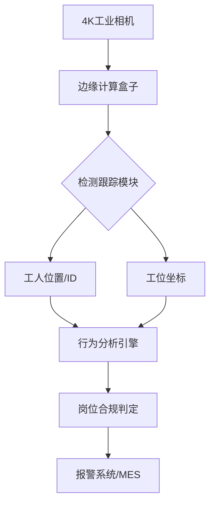

在工业车间场景中实现目标检测、跟踪与行为识别的全流程监控系统，需要结合计算机视觉技术与工业物联网架构。以下是基于最新研究进展的系统实现方案：

### 一、技术架构设计
#### 1. 多阶段模型选型
**目标检测模块**：
• 基础模型：采用YOLOv8实时检测工人与工位设备，其640×640输入分辨率在工业摄像头场景下平衡精度与速度
• 增强模块：叠加HRNet进行关键点检测，获取工人身体朝向角度（需标注头部、肩部关键点）

**目标跟踪模块**：
• 主跟踪器：DeepSORT算法，结合Kalman滤波与ReID特征，处理多人遮挡场景
• 辅助校验：引入改进型MeanShift，当DeepSORT置信度低于0.7时启动局部搜索

**行为识别模块**：
• 时空特征提取：TSN(Temporal Segment Networks)分析连续5帧的姿态序列
• 朝向判定：基于关键点的向量夹角计算（头部-双肩三角形朝向分析）

#### 2. 数据流架构


### 二、数据集构建方案
#### 1. 数据采集规范
• **空间覆盖**：采集8个不同工位的多角度视频（俯角30°-60°）
• **场景多样性**：
  • 正常工况：正确站位/操作姿势
  • 异常样本：背对设备、越区行走、长时间离岗
  • 干扰场景：光照变化（早中晚）、设备反光、流动车辆遮挡

#### 2. 标注标准
| 标注类型 | 规范要求                          | 工具           |
| -------- | --------------------------------- | -------------- |
| 目标检测 | YOLO格式，区分"工人"/"工位设备"   | LabelImg       |
| 关键点   | COCO格式17关键点，重点标注头/肩部 | CVAT           |
| 行为标签 | 三级分类：合规/方向偏离/离岗      | 自定义标注系统 |

#### 3. 数据增强策略
• **物理层面**：
  • 光照模拟：随机调整Gamma值(0.5-1.5)
  • 遮挡生成：添加虚拟设备投影（Blender渲染）
• **特征层面**：
  • 方向翻转：水平镜像+关键点坐标转换
  • 姿态混合：使用OpenPose生成中间姿态

### 三、模型训练方法
#### 1. 分阶段训练流程
1. **目标检测预训练**：
   • 基模型：COCO预训练的YOLOv8x
   • 微调数据：10,000张车间标注图像
   • 关键参数：batch_size=16, lr=0.001, mosaic增强开启

2. **跟踪模型适配**：
   • 提取车间场景的ReID特征库
   • 优化DeepSORT的匹配阈值（IoU=0.5→0.6）

3. **行为识别训练**：
   • 网络结构：TSM-ResNet50
   • 时序处理：16帧片段采样，时域stride=2
   • Loss设计：方向分类（交叉熵）+角度回归（Smooth L1）

#### 2. 关键训练技巧
• **跨模型蒸馏**：用HRNet的姿态估计结果指导TSN网络
• **困难样本挖掘**：对误判的背向样本进行3倍加权
• **域适应训练**：使用CycleGAN实现不同车间的风格迁移

### 四、部署实施方案
#### 1. 硬件选型
| 模块     | 推荐配置                   | 性能指标              |
| -------- | -------------------------- | --------------------- |
| 边缘设备 | Jetson AGX Orin            | 32GB显存，200TOPS算力 |
| 工业相机 | Hikvision DS-2CD6343FWD-IV | 3840×2160@25fps       |
| 报警终端 | 定制化PLC模块              | Modbus TCP协议接入    |

#### 2. 优化策略
• **模型量化**：
  • 检测模型：FP16量化（精度损失<1%）
  • 行为模型：INT8量化（需校准500张样本）

• **流水线加速**：
```python
# 多线程处理示例
with ThreadPoolExecutor(max_workers=4) as executor:
    det_future = executor.submit(detect, frame)
    track_future = executor.submit(track, prev_results)
    results = await asyncio.gather(det_future, track_future)
```

#### 3. 系统集成
• **数据接口**：
  • 输入：RTSP视频流（H.265编码）
  • 输出：JSON格式告警事件（含违规截图base64）

• **异常处理机制**：
  • 分级报警：方向偏离（一级）、离岗（二级）
  • 数据追溯：违规事件视频片段存储（保留7天）

### 五、效果验证指标
| 模块 | 评估指标       | 目标值 |
| ---- | -------------- | ------ |
| 检测 | mAP@0.5        | ≥0.92  |
| 跟踪 | MOTA           | ≥0.85  |
| 行为 | 方向识别准确率 | ≥95%   |
| 系统 | 端到端延迟     | <500ms |

实际部署建议采用分阶段验证：
1. 实验室环境：测试各模块极限性能
2. 试点工位：连续运行72小时压力测试
3. 全车间推广：建立误报反馈机制持续优化

该方案综合运用了目标检测、跟踪与行为识别的前沿技术，通过多模型协同与工程化优化，可有效满足工业场景下的岗位合规监测需求。实施时需重点注意数据隐私保护，建议在边缘设备完成全部处理，仅上传告警事件元数据。